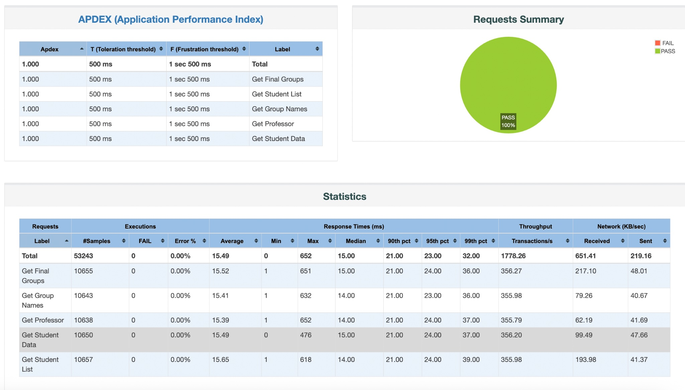
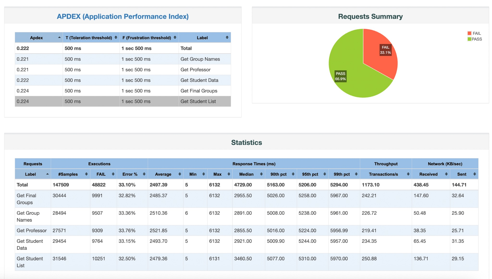

# CI/CD with Custom API + Apache JMeter

## Project Overview
This project demonstrates a CI/CD Pipeline for the deployment, testing, and monitoring of a custom API.  
The solution integrates **Docker, Ngrok, Jenkins, GitHub, Python (FastAPI), Apache JMeter, and Webex**.

The custom API includes multiple GET commands allowing users to retrieve data on Cal Poly Pomona's Fall 2025 GBA 6270 students, professor, and groups for project assignments. This API is load tested using Apache JMeter to determine if it is capable of handling simultaneous requests from API users.

Project By: Finn Thomas and Hugo Rosales

## Repository Structure
```
.
├── api			# Folder for API components
│   ├── __init__.py
│   ├── class_api.py		# Contains the FastAPI
│   └── class_data.py		# Contains the Database queried through the API
├── JenkinsFile		# Groovy script for Jenkins pipeline
├── jmeter			# Folder for jmeter components
│   └── load_test.jmx		# Contains the Test Plan for load testing
├── README.md
├── requirements.txt	# Project's required python packages
├── test_class_api.sh	# Script to run the python test suite
└── tests			# Folder for Pytest suite
    ├── __init__.py
    ├── golden_data.py		# 'Golden' set of student data for test verification
    └── test_api.py			# Pytest suite for verifying API functionality
```

### CI/CD Pipeline Workflow
1. **GitHub Push** – New code is added into the repository including API Code, Pytests, and JMeter Test Plans.
2. **Webhook Event** – Github Webhook with Ngrok notifies Jenkins to start the build.
3. **Checkout** – Jenkins pulls the latest build from the repository
4. **API Launch** – The python API is launched in the background of the jenkins build with uvicorn, so that is running continuously while the tests occur.
5. **Functionality Tests** – Pytest suite runs to ensure the API is functioning properly
6. **Clean Up Reports** – Remove old JMeter reports to make room for the new reports.
7. **JMeter Baseline Test** – JMeter runs a realistic load test (30 concurrent users) on the API to ensure stability and creates a report.
8. **JMeter Stress Test** – JMeter ramps up traffic to 5,000 concurrent users to determine the system's breaking point and creates a report.
9. **Terminate API** – The JMeter reports are done generating, so the API background process is terminated (old reports are purged).
10. **Report Compile** –  JMeter reports are zipped up and archived as artifacts so that they can be downloaded and viewed.
11. **Notify Webex Space** – The build link, along with the download links for JMeter reports for Baseline and Stress testing are sent to a Webex space.

### Technologies Used
- **Source Control:** GitHub  
- **CI/CD Orchestrator:** Jenkins (running in Docker container)  
- **API Framework:** Python FastAPI + Uvicorn  
- **Testing:** Custom Python Pytest Suite  
- **Performance Testing:** Apache JMeter 5.6.3 (Custom Install)
- **Notification Service:** Cisco Webex  
- **Tunneling:** Ngrok (for GitHub Webhooks)

## Setting Up the Environment
To create a portable and isolated environment, Docker is utilized to host the Jenkins server. This required manual configuration to support specific tooling needs for this project. The setup steps are as follows:

1. Launch Jenkins using the official LTS image, mapping the necessary ports and volume data:
```bash
docker run --name jenkins -p 8080:8080 -p 50000:50000 jenkins/jenkins:lts
```

2. The standard Jenkins container lacks the specific tools required for this workflow. We accessed the container via docker exec to perform the following upgrades:
Enter container:
```bash
docker exec -u root -it jenkins /bin/bash
```

Python Environment: Installed python3, pip, uvicorn, httpx to run the API and test suite.
```bash
apt-get install -y python3 python3-pip uvicorn httpx
```

The default Linux package for JMeter (v2.13) was too old to generate HTML dashboards. We manually downloaded and installed JMeter 5.6.3 into the /opt directory to enable advanced reporting features.

```bash
apt-get update && apt-get install -y wget
cd /opt
wget https://archive.apache.org/dist/jmeter/binaries/apache-jmeter-5.6.3.tgz
tar -xzf apache-jmeter-5.6.3.tgz
```

3. Download Ngrok and run it using:
```bash
ngrok http 8080
```

4. Create a new project pipeline in Jenkins

5. Create Webhook in github using ngrok forwarding link. It should look something like <https://ngrokname.ngrok-free.dev>. Additionally, add this link to Jenkins in Settings: Manage Jenkins → System → Jenkins URL. Finally, in the Jenkins configuration check the box that says "GitHub hook trigger for GITScm polling".

6. Add the JenkinsFile from the repository to the pipeline script box in the Jenkins Pipeline's configuration tab.

7. Clone the repository to the local machine so that you can push changes to start the build.

## Class API – Available Commands

| Command | Description |
|--------|-------------|
| GET /professor | Fetch professor name |
| GET /students | Fetch list of all students |
| GET /student?name=[Full Student Name] | Fetch specific student data |
| GET /groups | Fetch all group assignment names |
| GET /groups?name=[Group assignment name] | Fetch specified group assignment data |

## Apache JMeter Test Design & Parameterization:

The JMeter Test Plan uses dynamic parameters to avoid hard‑coding:

| Parameter | Description |
|----------|-------------|
| `${__P(users)}` | Number of concurrent users |
| `${__P(rampup)}` | User ramp‑up rate |
| `${__P(duration)}` | Test duration |

This design allows us to use one single test file to perform both "Realistic" (30 users) and "Stress" (5,000 users) tests simply by changing the Jenkins command arguments.

The pipeline runs two distinct tests to provide a full performance analysis:
1. **Realistic Test:** Runs with -Jusers=30 to verify the API works for a normal class size
2. **Stress Test:** Runs with -Jusers=5000 and -Jrampup=100 to aggressively load the server and find the failure point.

## Example JMeter Results

**Realistic Test Example JMeter Report:**



**Stress Test Example JMeter Report:**

